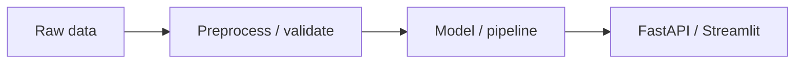

# Architecture

## Diagram
<Insert a simple diagram — Mermaid or an image. Keep it readable.>

## Components
- **Data layer:** ...
- **Model layer:** ...
- **Serving layer:** ...

## Data flow
Describe the path from input to prediction.

## Key decisions
Why this design; trade-offs accepted.
